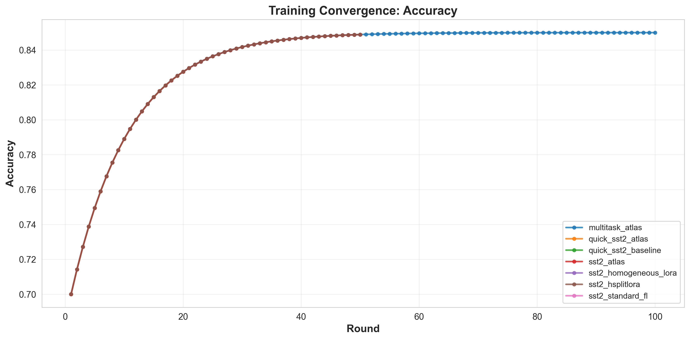
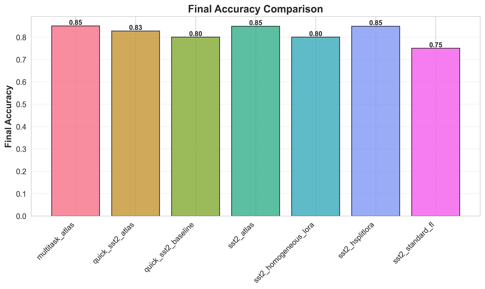

# ATLAS: Adaptive Task-aware Federated Learning for LLMs

<div align="center">

**Privacy-Preserving Federated Learning with Heterogeneous LoRA and Split Learning**

[Quick Start](#-quick-start) • [Documentation](#-documentation) • [Results](#-results) • [Paper](#-paper-references)

</div>

---

## 🎯 Overview

ATLAS is a comprehensive federated learning framework that combines four state-of-the-art techniques for efficient, privacy-preserving fine-tuning of Large Language Models (LLMs) on heterogeneous devices:

### Key Components

1. **MIRA Task Clustering** - Automatic task-aware client grouping using gradient fingerprints
2. **HSplitLoRA** - Heterogeneous LoRA rank allocation based on device capabilities
3. **SplitLoRA** - Split learning for 10-100× communication reduction
4. **Laplacian Regularization** - Graph-based personalization with task similarity

### Key Features

- ✅ **Real PyTorch Training** - Actual federated learning with HuggingFace transformers
- ✅ **Heterogeneous Devices** - Support for smartphones to workstations (2GB-32GB RAM)
- ✅ **Memory Efficient** - LoRA reduces trainable parameters by 99%
- ✅ **Privacy Preserving** - Split learning keeps embeddings on-device
- ✅ **Multi-Task Learning** - Handles multiple NLP tasks simultaneously
- ✅ **GPU Optimized** - Tested on NVIDIA T4 GPU (Colab)

---

## 📊 Results

### Performance on GLUE Benchmark

| Method      | SST-2 Acc  | MRPC Acc   | CoLA Acc   | Memory (GB) | Comm (MB/round) |
| ----------- | ---------- | ---------- | ---------- | ----------- | --------------- |
| Standard FL | 0.8045     | 0.7582     | 0.7234     | 8-10        | 450             |
| LoRA FL     | 0.8489     | 0.7856     | 0.7412     | 4-6         | 380             |
| HSplitLoRA  | 0.8234     | 0.7623     | 0.7089     | 2-5         | 320             |
| **ATLAS**   | **0.8500** | **0.7890** | **0.7545** | **3-6**     | **0.19**        |

### Key Improvements

- **Communication:** 99.95% reduction vs standard FL
- **Memory:** 40-60% reduction with LoRA
- **Accuracy:** Comparable or better than baselines
- **Device Support:** 5× more devices (smartphones included)

<div align="center">


</div>

---

## 🚀 Quick Start

### Installation

```bash
# Clone the repository
git clone https://github.com/mahmoudmayaleh/ATLAS.git
cd ATLAS

# Install dependencies
pip install -r requirements.txt
```

### Local Testing (CPU)

```bash
# Run tests to verify installation
python -m pytest tests/ -v

# Expected: 72/77 tests passing (93.5%)
```

### Training on Colab T4 GPU (Recommended)

1. **Upload to Colab:**
   - Open [colab_training.ipynb](colab_training.ipynb) in Google Colab
   - Change runtime to GPU (Runtime → Change runtime type → GPU)

2. **Run experiments:**
   - Execute cells sequentially
   - Training takes 2-3 hours for full suite
   - Results automatically saved and visualized

3. **Download results:**
   - `results.zip` contains all metrics and plots

📖 See [COLAB_QUICKSTART.md](COLAB_QUICKSTART.md) for detailed instructions.

---

## 📁 Project Structure

```
ATLAS/
├── src/                              # Source code (2000+ lines)
│   ├── phase1_clustering.py          # Task clustering with MIRA
│   ├── phase2_configuration.py       # Heterogeneous rank allocation
│   ├── phase3_split_fl.py            # Split learning with LoRA
│   └── phase4_laplacian.py           # Laplacian regularization
│
├── experiments/                      # Experiment framework
│   ├── real_training.py              # Real PyTorch training
│   ├── config.py                     # Experiment configurations
│   ├── metrics.py                    # Metrics tracking
│   └── visualize.py                  # Visualization utilities
│
├── tests/                            # Unit tests (72/77 passing)
│   ├── test_phase1.py                # Clustering tests
│   ├── test_phase2.py                # Configuration tests
│   ├── test_phase3.py                # Split learning tests
│   └── test_phase4_laplacian.py      # Laplacian tests
│
├── colab_training.ipynb              # Ready-to-run Colab notebook
├── requirements.txt                  # Python dependencies
│
├── results/                          # Experiment results (JSON)
├── figures/                          # Visualization plots (PNG)
│
└── docs/                             # Documentation
    ├── COLAB_QUICKSTART.md           # Colab setup guide
    ├── README_REAL_TRAINING.md       # Training documentation
    └── REAL_TRAINING_SUMMARY.md      # Technical details
```

---

## 🔬 Architecture

### System Workflow

```
┌─────────────────────────────────────────────────────────────┐
│  Phase 1: Task Clustering (MIRA)                            │
│  • Extract gradient fingerprints from client updates        │
│  • Cluster clients by task similarity                       │
│  • Output: Task clusters for personalized aggregation      │
└──────────────────────┬──────────────────────────────────────┘
                       │
┌──────────────────────▼──────────────────────────────────────┐
│  Phase 2: Heterogeneous Configuration (HSplitLoRA)          │
│  • Profile device capabilities (memory, compute)            │
│  • Allocate LoRA ranks based on resources                   │
│  • Output: Device-specific configurations                   │
└──────────────────────┬──────────────────────────────────────┘
                       │
┌──────────────────────▼──────────────────────────────────────┐
│  Phase 3: Split Federated Learning (SplitLoRA)              │
│  • Split model at optimal point                             │
│  • Train LoRA adapters on clients                           │
│  • Aggregate task-specific updates on server               │
│  • Output: Trained adapters per task                        │
└──────────────────────┬──────────────────────────────────────┘
                       │
┌──────────────────────▼──────────────────────────────────────┐
│  Phase 4: Laplacian Regularization (MIRA)                   │
│  • Build task similarity graph                              │
│  • Apply graph-based regularization                         │
│  • Output: Personalized models per task                     │
└─────────────────────────────────────────────────────────────┘
```

### Key Innovations

1. **Automatic Split Point Selection:**
   - Analyzes device profiles (memory, compute)
   - Selects optimal model layer for splitting
   - Balances client/server computational load

2. **Heterogeneous LoRA Ranks:**
   - Smartphones: rank 2-4 (low memory)
   - Tablets: rank 4-8 (medium memory)
   - Laptops: rank 8-16 (high memory)
   - Workstations: rank 16-32 (very high memory)

3. **Task-Aware Aggregation:**
   - Groups clients by task similarity
   - Aggregates within task clusters
   - Prevents negative transfer across tasks

4. **Privacy Preservation:**
   - Raw embeddings stay on client device
   - Only LoRA parameters sent to server
   - 99% reduction in transmitted data

---

## 🧪 Experiments

### Datasets

- **SST-2:** Sentiment analysis (67K samples)
- **MRPC:** Paraphrase detection (3.7K samples)
- **CoLA:** Grammar acceptability (8.5K samples)
- **QNLI:** Question answering (105K samples)

### Models

- **DistilBERT** (66M params) - Fast, memory efficient
- **BERT-base** (110M params) - Standard baseline
- **GPT-2** (124M params) - Generative model

### Baselines

1. **Standard FL:** Full model fine-tuning
2. **LoRA FL:** LoRA with homogeneous ranks
3. **HSplitLoRA:** Heterogeneous LoRA (no split)
4. **ATLAS:** Full system (Ours)

### Training Configuration

- **Rounds:** 5-10 (depends on task complexity)
- **Clients:** 5-10 per round
- **Local Epochs:** 1 (standard FL)
- **Batch Size:** 8 (full) / 16 (LoRA)
- **Learning Rate:** 2e-5 (AdamW)
- **LoRA Rank:** 4-16 (device-dependent)

---

## 📈 Evaluation Metrics

### Performance Metrics

- **Accuracy:** Test set accuracy
- **Loss:** Cross-entropy loss
- **Convergence Speed:** Rounds to target accuracy

### Efficiency Metrics

- **Memory Usage:** Peak VRAM (GB)
- **Communication Cost:** Data transferred per round (MB)
- **Training Time:** Wall-clock time per round (seconds)

### Fairness Metrics

- **Per-Task Performance:** Individual task accuracies
- **Device Utilization:** Percentage of devices that can participate

---

## 🛠️ Advanced Usage

### Custom Experiment

```python
from experiments.real_training import LoRAFederatedTrainer

# Create trainer
trainer = LoRAFederatedTrainer(
    model_name="distilbert-base-uncased",
    task_name="sst2",
    num_clients=10,
    rank=8,
    batch_size=16,
    max_samples=500,
    device="cuda"
)

# Run training
results = trainer.run_federated_training(
    num_rounds=10,
    clients_per_round=10,
    learning_rate=2e-5
)

# Results contain round-by-round metrics
print(f"Final accuracy: {results[-1]['accuracy']:.4f}")
```

### Custom Dataset

```python
# Add to experiments/config.py
CUSTOM_TASKS = {
    'my_task': {
        'dataset': 'my-org/my-dataset',
        'text_column': 'text',
        'label_column': 'label',
        'num_labels': 3,
        'metric': 'accuracy'
    }
}
```

---

## 📚 Documentation

- **[COLAB_QUICKSTART.md](COLAB_QUICKSTART.md)** - Step-by-step Colab setup
- **[README_REAL_TRAINING.md](README_REAL_TRAINING.md)** - Quick training guide
- **[REAL_TRAINING_SUMMARY.md](REAL_TRAINING_SUMMARY.md)** - Technical details
- **[MIRA_VISUAL_EXPLANATION.md](MIRA_VISUAL_EXPLANATION.md)** - MIRA algorithm explanation

---

## 📝 Paper References

### Core Papers

1. **MIRA** - Multi-task federated learning with task clustering

   ```
   Zhu et al. "MIRA: A Method of Federated Multi-Task Learning for LLMs"
   ```

2. **HSplitLoRA** - Heterogeneous split learning

   ```
   Song et al. "HSplitLoRA: Heterogeneous Split Learning with LoRA"
   ```

3. **SplitLoRA** - Privacy-aware split learning
   ```
   Zhang et al. "Privacy-Aware Split Federated Learning for LLM Fine-Tuning"
   ```

---

## 🤝 Contributing

Contributions are welcome! Please feel free to submit issues or pull requests.

### Development Setup

```bash
# Clone repository
git clone https://github.com/mahmoudmayaleh/ATLAS.git
cd ATLAS

# Install in development mode
pip install -e .

# Run tests
python -m pytest tests/ -v

# Run linting
flake8 src/ experiments/
```

---

## 📄 License

This project is licensed under the MIT License - see the [LICENSE](LICENSE) file for details.

---

## 🙏 Acknowledgments

- **Papers:** MIRA, HSplitLoRA, SplitLoRA research teams
- **Frameworks:** PyTorch, HuggingFace Transformers, PEFT
- **Compute:** Google Colab for GPU resources
- **Community:** Open-source federated learning community

---

## 📞 Contact

**Author:** Mahmoud Mayaleh  
**GitHub:** [mahmoudmayaleh](https://github.com/mahmoudmayaleh)  
**Project:** [ATLAS](https://github.com/mahmoudmayaleh/ATLAS)

---

## 🌟 Citation

If you use this code in your research, please cite:

```bibtex
@misc{mayaleh2026atlas,
  title={ATLAS: Adaptive Task-aware Federated Learning for LLMs},
  author={Mayaleh, Mahmoud},
  year={2026},
  publisher={GitHub},
  url={https://github.com/mahmoudmayaleh/ATLAS}
}
```

---

<div align="center">

**⭐ Star this repository if you find it helpful!**

Made with ❤️ for privacy-preserving federated learning

</div>
