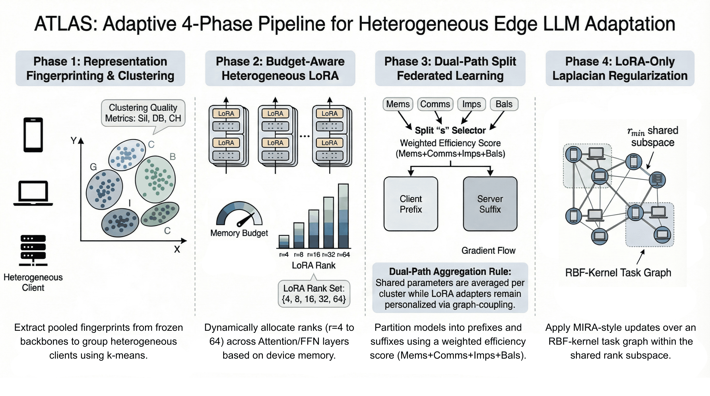

# ATLAS

ATLAS is a research codebase for adaptive, task-aware federated fine-tuning of language models on heterogeneous clients. The maintained workflow centers on a single integrated experiment runner, reproducible seed-based launch scripts, and post-processing utilities for tables and figures.

## Repository Scope

- `src/` implements the clustering, configuration, split-learning, and Laplacian phases.
- `experiments/atlas_integrated.py` is the primary entrypoint for classification experiments.
- `tests/` contains the maintained unit test suite.
- Generated artifacts such as logs, checkpoints, result JSON files, and paper assets are intentionally excluded from version control.

## Supported Workflows

### Classification experiments

The current maintained classification tasks are:

- `sst2`
- `mrpc`
- `qnli`

Configured model aliases in the current experiment stack include:

- `distilbert-base-uncased`
- `bert-base-uncased`
- `gpt2`
- `gpt2-xl`
- `Qwen/Qwen2.5-0.5B`
- `Qwen/Qwen2.5-1.5B`

### Baselines

- `atlas`
- `atlas_no_laplacian`
- `fedavg_cluster`
- `standard_fl`
- `local_only`

## Quick Start

```bash
git clone <your-repository-url>

cd ATLAS
python3 -m venv .venv
source .venv/bin/activate
pip install -r requirements.txt
```

Run a short sanity check:

```bash
python experiments/atlas_integrated.py \
   --mode quick \
   --ablation atlas \
   --tasks sst2 mrpc qnli \
   --rounds 2 \
   --samples 80 \
   --local-epochs 1 \
   --seed 42
```

Run a fuller experiment:

```bash
python experiments/atlas_integrated.py \
   --mode full \
   --ablation atlas \
   --model distilbert-base-uncased \
   --tasks sst2 mrpc qnli \
   --clients-per-task 3 \
   --rounds 10 \
   --samples 3000 \
   --local-epochs 3 \
   --seed 42
```

## Reproducible Multi-Seed Runs

The repository includes fixed-seed helper scripts for multi-GPU launch patterns:

- `gpu0_seed42.sh`
- `gpu1_seed123.sh`
- `gpu2_seed456.sh`

Example:

```bash
./gpu0_seed42.sh distilbert-base-uncased atlas
./gpu1_seed123.sh gpt2 standard_fl
./gpu2_seed456.sh Qwen/Qwen2.5-0.5B atlas
```

## Outputs

The main runner writes generated files under:

- `results/`
- `checkpoints/`
- `logs/`

These are treated as build artifacts and are ignored by default.

## Documentation

- `RUN_INSTRUCTIONS.md`: concise setup and execution guide
- `docs/EXPERIMENTS.md`: experiment entrypoints, ablations, and outputs
- `docs/IEEE_PUBLICATION_GUIDE.md`: reproducibility checklist for paper runs
- `experiments/README.md`: experiment package overview

## Validation

```bash
python -m pytest tests -v
```

## License

This repository is distributed under the terms of the MIT license. See `LICENSE` for details.
